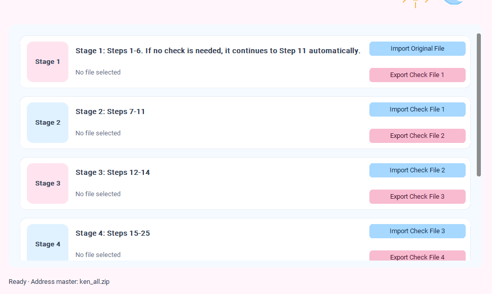

# Excel Data Cleaner

## Overview

Excel Data Cleaner is a Python desktop application that automates Excel workbook cleaning while preserving formatting, merged cells, row heights, column widths, and worksheet settings.

This project was developed to streamline repetitive Excel processing tasks and improve workflow efficiency.

## Screenshot



## Highlights

- Preserves Excel formatting after processing
- Maintains merged cells and worksheet layout
- Simple GUI for non-technical users
- Designed to automate repetitive Excel processing tasks

## Features

- Clean and process Excel workbooks
- Preserve cell formatting
- Preserve merged cells
- Preserve row and column dimensions
- Preserve worksheet settings
- Simple graphical user interface (GUI)

## Technologies

- Python
- OpenPyXL
- Tkinter

## Getting Started

1. Clone this repository.

2. Install the required dependency:

```bash
pip install openpyxl
```

3. Run the application:

```bash
python app.py
```

## Future Improvements

- Batch processing
- Drag-and-drop support
- Progress bar
- Logging

## Core Capabilities

- Preserves cell styles and formatting
- Retains merged cells
- Maintains row heights and column widths
- Preserves freeze panes and AutoFilter settings
- Supports workbook-level processing

## Project Structure

```text
.
├── app.py          # GUI entry point
├── processor.py    # Excel processing logic
├── README.md
├── LICENSE
└── .gitignore
```
